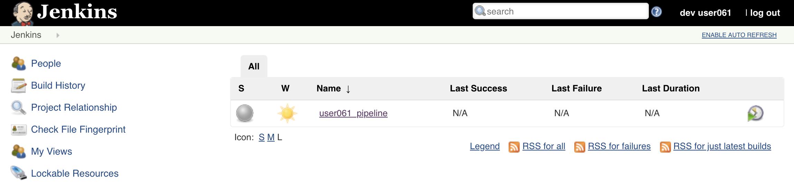
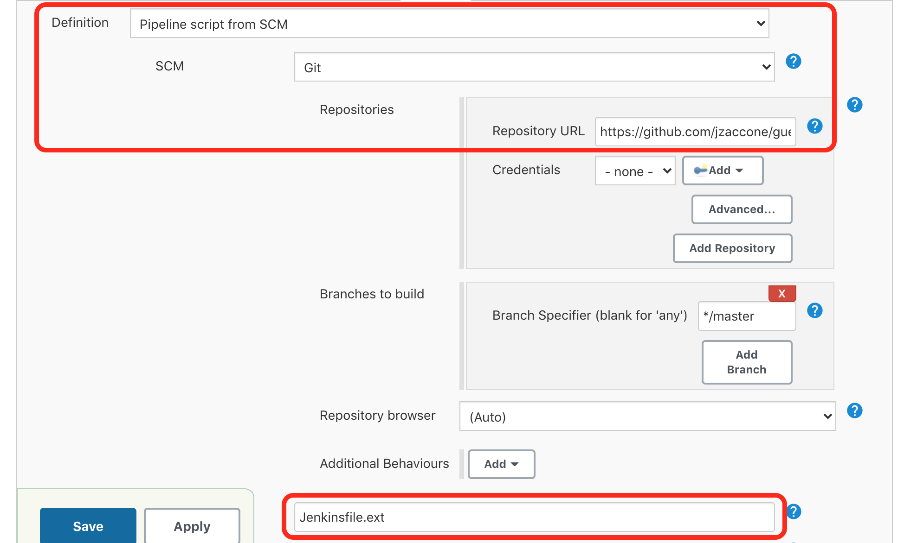
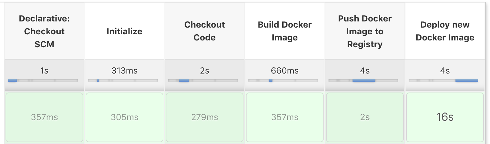
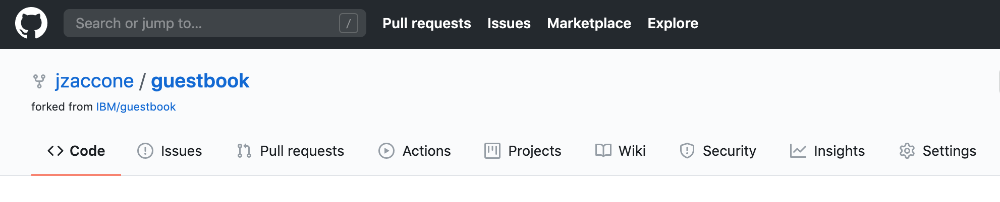

# Creating a CI/CD Pipeline for deployment to IBM Cloud Kubernetes Service using Jenkins

## Overview

In this lab you will be enabling CI/CD connecting your Git repository with the guestbook app to a Continuous Integration/Continuous Deployment pipeline built with Jenkins that will deploy to a IBM Cloud Kubernetes Service cluster.

## Setup

If you haven't already:

1. Fork the [guestbook application](https://github.com/IBM/guestbook). You will need to create a GitHub account if you don't have one already.

2. Clone your fork of the guestbook application, then `cd` into that directory.

```shell
git clone https://github.com/[git username]/guestbook
cd guestbook
```

### Step 0: Create and collect: API Key, Registry Namespace and Cluster Name

We will need all these values when we configure our Jenkins pipeline later.

1. From the IBM Cloud console, open the cloud shell. Make sure you have the right account selected in the dropdown (the one with your Kuebrnetes cluster which you want to deploy to)


2. Create an API key using the following command. **Copy and Paste** the key value, we will use it later in our Jenkins Pipeline

```
ibmcloud iam api-key-create [key name]
```

3. Create or access a container registry namespace.

First, see if you have access to one already.

```sh
ibmcloud cr namespace-list
```

If you get a value above, copy and paste for later. If you have no namespaces created, run the following command to create one.

```sh
ibmcloud cr namespace-add [namespace name]
```

4. Access and save the name of your Kubernetes Cluster on IBM Cloud.

```sh
ibmcloud ks clusters
```

### Step 1: Add Jenkinsfile to the Guestbook App

Copy this [JenkinsFile](Jenkinsfile.ext) to the root of your guestbook project. We have provided a curl script for your convience. 

```sh
curl https://raw.githubusercontent.com/IBMAppModernization/app-modernization-cicd-lab-iks/helm-v3/Jenkinsfile.ext > Jenkinsfile.ext
```

Configure git client (if needed)
```sh
git config --global user.email "[your email]"
git config --global user.name "[your first and last name]"
```

Commit the changes
```sh
git add .
```

```sh
git commit -m "adding jenkinsfile"
```

Push the changes to your repo
```sh
git push
```

Inspect the [JenkinsFile](Jenkinsfile.ext) to learn what stages we will setup in the next steps.

### Step 2: Set up the CI/CD pipeline

In this section we will be connecting your forked Git repo of [this app](https://github.com/IBM/guestbook) to set up a Continuous Integration/Continuous Deployment pipeline built with Jenkins. This pipeline contains 3 main steps as follows:

  | Stage                         | Purpose                                                                        |
  | ----------------------------- | ------------------------------------------------------------------------------ |
  | Build Docker Image            | Builds the Docker image based on the Dockerfile                                |
  | Push Docker Image to Registry | Uploads the Docker image to the Docker image registry within ICP               |
  | Deploy New Docker Image       | Updates the image tag in the Kubernetes deployment triggering a rolling update |

More details of this pipeline can be found in the [Jenkinsfile](Jenkinsfile).

1. Log into Jenkins using the URL provided to you by your instructor with the credentials provided to you

2. The pipeline should have already been created for you.



3. Click on your pipeline to open it and then click on the **Configure** link in the navigation area at the left to change it's properties

4. Scroll down to the **This project is parameterized**, here you will have to set some values to connect this pipeline to your cluster

- Set the value of **API_KEY** to the API_KEY you created earlier for your ibmcloud account. We will be using this key to give access to deploy to your cluster and to push images to your container registry

- Set the value of the **CLUSTER_NAME** to the name of your Kubernetes cluster you want to deploy to.

- Set the value of the **REGISTRY_NS** to the name of your container registry namespace you viewed (or created) earlier. We will deploy our application image to this location

- Leave the default value of **REGION** unless instructed otherwise. This should match the location of your Kubernetes cluster.

5. Scroll down to the **Build Trigger** section and select **GitHub hook trigger for GIT SCM polling**


6. Scroll down to the **Pipeline** section and find the **Definition** drop down menu. Select **Pipeline script from SCM** and for **SCM** select **Git**.

7. For **Repository URL** enter the url to the cloned repository that you forked earlier (i.e. `https://github.com/[your username]/guestbook.git`)

8. Change the **Script Path** to `Jenkinsfile.ext`




8. Click **Save**.

### Step 3: Manually trigger a build to test pipeline

1. In Jenkins in the navigation area on the left click on **Build with Parameters**. Accept the defaults of the parameters and click on **Build**

2. To see the console output click on the build number in the **Build History** and then click on **Console Output**


3. If the build is successful the end of the console output should look like the following:


&nbsp;&nbsp;&nbsp;&nbsp;&nbsp;&nbsp;The Stage View of the pipeline should look like the following:


### Step 4: Trigger a build via a commit to Github

Now you'll configure Github to trigger your pipeline whenever code is committed.

1. Go back to Github and find your cloned repository

2. Click on the repository settings



3. Under **Options** select **Webhooks** and click **Add webhook**


4. For the Payload URL use `<Jenkins URL>/github-webhook/`  where `<Jenkins URL>` is the  URL you used  to login to Jenkins (**Note** Don't forget the trailing `/`)

5. Change content type to **application/json**

6. Accept the other defaults and click **Add webhook**


7. In the Github file browser drill down to */v1/guestbook/public/index.html*

8. Click on the pencil icon to edit **index.html**  and on line 12 locate the header of the page

9. Change  `Guestbook - v1` to `Guestbook - updated!`... or whatever you want!

10. At the bottom of the UI window add a commit message and click on **Commit changes**

11. Switch back to Jenkins  and open the pipeline that you were working on  earlier.

12. Verify that your pipeline  starts building.

13. When the pipeline is finish deploying, launch the app to verify the change you made.

14. From the cloud shell, run the following command to configure your `kubectl` client to talk to your cluster

   ```
   ibmcloud ks cluster config --cluster [cluster name]
   ```

15. Next, run the following command to get the port number of your deployed app

   ```
   kubectl --namespace default get service guestbook -o jsonpath='{.spec.ports[0].nodePort}'
   ```

15. Run the following command to get the external IP address  of the first worker node in your cluster

   >Replace $CLUSTER_NAME with the name of your cluster

   ```bash
   ibmcloud cs workers --cluster $CLUSTER_NAME | grep -v '^*' | egrep -v "(ID|OK)" | awk '{print $2;}' | head -n1
   ```

16. Your app's URL is the IP address of the first worker node with the port number of the deployed app. For example if your external IP is 169.61.73.182 and the port is 30961 the URL will be ```http://169.61.73.182:30961```

17. Enter the URL in hr browser's address bar and verify that the header of the page has been changed.


## Summary

You created a Jenkins pipeline to automatically build and deploy an app that has been updated in Github.
